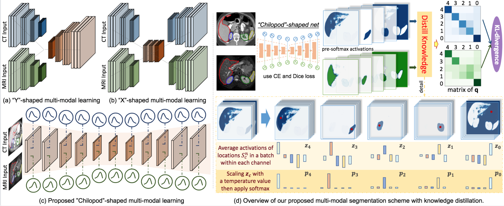

# UMMKD

<p align="left">
    
</p>

[**_Unpaired Multi-modal Segmentation with Knowledge Distillation_**](https://carrend.github.io/)

> We propose a novel learning scheme for unpaired cross-modality image segmentation, with a highly compact architecture achieving superior segmentation accuracy. In our method, we heavily reuse network parameters, by sharing all convolutional kernels across CT and MRI, and only employ modality-specific internal normalization layers which compute respective statistics. To effectively train such a highly compact model, we introduce a novel loss term inspired by knowledge distillation, by explicitly constraining the KL-divergence of our derived prediction distributions between modalities. We have extensively validated our approach on two multi-class segmentation problems: i) cardiac structure segmentation, and ii) abdominal organ segmentation. Different network settings, i.e., 2D dilated network and 3D U-Net, are utilized to investigate our method's general efficacy. 

This is the reference implementation of the unpaired multi-modal segmentation method described in our paper:
```
@inproceedings{dou2020unpaired,
    author = {Qi Dou and Quande Liu and Pheng Ann Heng and Ben Glocker},
    title = {Unpaired Multi-modal Segmentation via Knowledge Distillation},
    booktitle = {IEEE Transactions on Medical Imaging},
    year = {2020},
}
```

If you make use of the code, please cite the paper in any resulting publications.

## Setup

Check dependencies in requirements.txt, and necessarily run
```
pip install -r requirements.txt
```


## Running UMMKD
### 2D version
To run our 2D version, can directly use the tfrecord data released in our another relevant project from [here](https://github.com/carrenD/Medical-Cross-Modality-Domain-Adaptation)

To train the model, specify the training configurations (can simply use the default setting), in main_combine.py set:

```
restored_model = None
main(restored_model = restored_model, phase='training')
```

To test the model, specify the path of the model to be tested, in main_combine.py set:
```
test_model = '/path/to/test_model.cpkt'
source_dice, target_dice = main(test_model=test_model, phase='testing')
```

Tensorboard will be automatically launched with port specified in main_combine.py

### 3D version
To run our 3D version, first:

```
cd 3d_implementation
```

To train the model, specify the training configurations (can simply use the default setting) in main.py, then run:

```
python main.py
```

To test the model, specify the path of tested model in test.py:
```
test_model = '/path/to/test_model.cpkt'
```
then run:
```
python test.py
```
